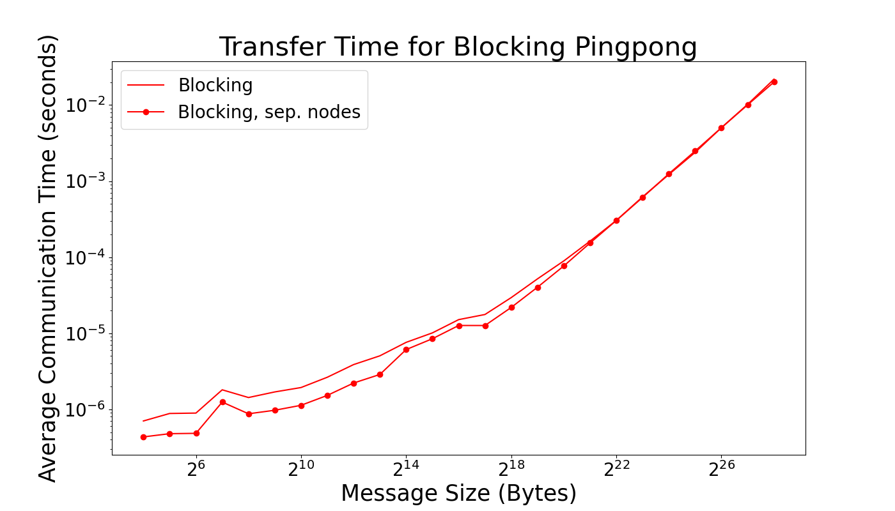
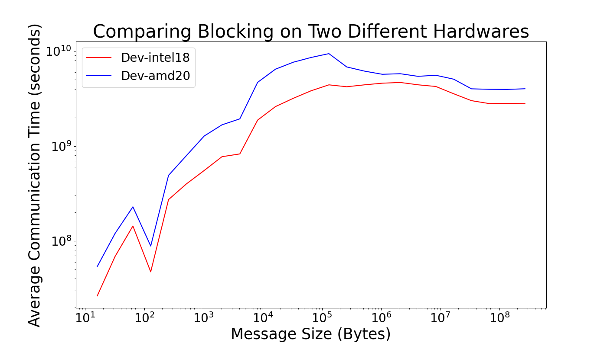
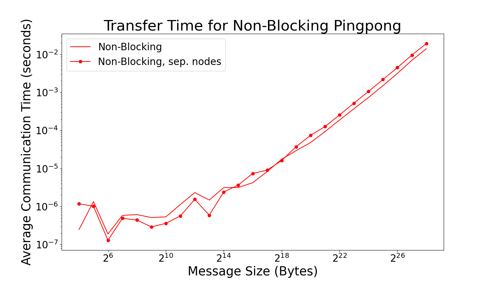
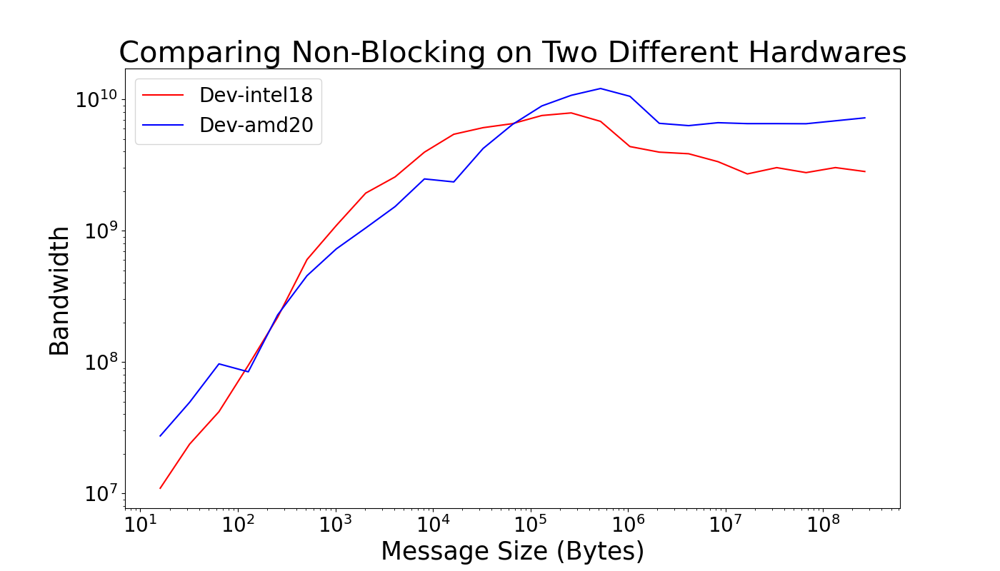
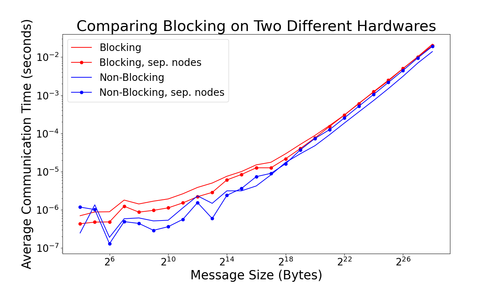
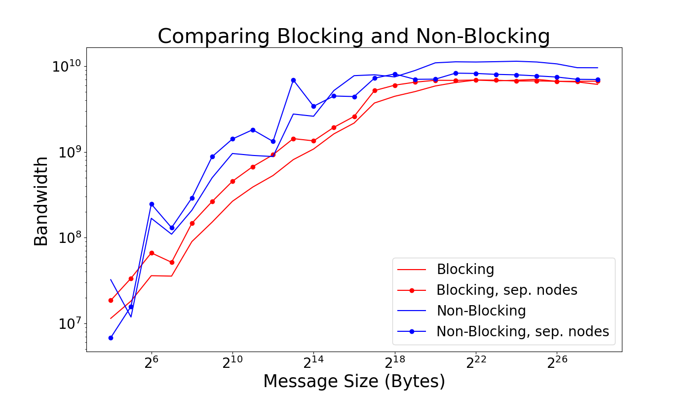

# Project 3

## Part 1

### 1.1 to 1.3 Solution 
 
Done! Check Part1.cpp. Executed on dev-amd20.

### 1.4 Solution 

Done! Check Part1.cpp. Different nodes ensured by binding each process to a different NUMA node.

### 1.5 Solution 

The latency for each is clearly different, but the effect seems to be lower at larger byte sizes where the latencies almost overlap. 

However, the bandwidth (which we strictly calculated and plot rather than estimating) seems to maintain a realtively constant difference (in a log/log plot).  

### 1.6 Solution 

For small messages sizes the average communication time is relatively flat as here we are bound by the latenecy of the system. This is not true for larger messages where we are bound by the bandwidth of the system. There are different latencies for different nodes which is why the horizontial(ish) lines at low message size are at different hieghts. The values converge at higher message sizes because the bandwidth should be (approximaetly) the same for the whole system as the whole system will have the same bandwidth. 

## Part 2

See Part2.cpp for code. Executed on dev-amd20, and different nodes ensured by binding each process to a different NUMA node.

The latency for each is clearly different, but at lower message sizes, ensuring separate nodes pays off. While at higher message sizes, the latency is higher for separate nodes.  

 

At low message sizes, the overhead associated with inter-node communication is relatively small. When both ping-pong processes are on separate nodes, the latency is reduced because communication between nodes typically involves higher overhead. As message size increases, the benefit of ensuring separate nodes reduces. At higher message size, the time spent on actual data transfer becomes a more dominant factor than the overhead of data transfer between physically separate nodes.

Opposed to latency, the bandwidth sees an opposite trend between same and separate nodes. Having both ping-pongs on separate nodes at low message sizes allows for more efficient use of the avaialable bandwidth. The reduced inter-node communication overhead allows a higher portion of the bandwidth to be utilized for actual data transfer. Whereas, the overhead becasue of longer physical distance between nodes becomes more pronounced at higher message size, leading to a reduction in effective bandwidth. 

### Comparison Blocking vs. Non-Blocking

The latency in non-blocking case is less than the latency of the blocking case. The lower latency in non-blocking communication is expected because processes can have an overlap in sending and receiving messages, reducing the overall time. The slightly chaotic behavior at small message sizes can be attributed to the overhead introduced by non-blocking communication. 

 

The consistently higher bandwidth in non-blocking communication compared to blocking aligns with our expectations, as it allows processes to operate more independently, enabling better utilization of available bandwidth / resources.

## Part 3 

## Part 4

