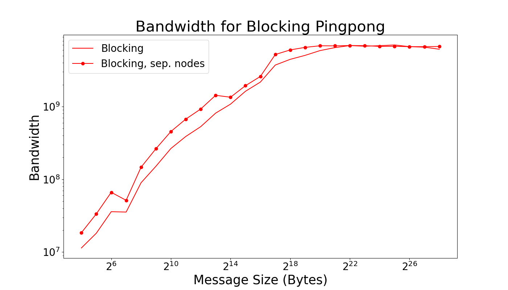

# Project 3

## Part 1

### 1.1 to 1.3 Solution 
 
Done! Check Part1.cpp. Executed on dev-amd20.

### 1.4 Solution 

Done! Check Part1.cpp. Different nodes ensured by binding each process to a different NUMA node.

### 1.5 Solution 

The latency for each node system is clearly different, but the effect seems to be lower at larger byte sizes. 

However, the bandwidth (which we strictly calculated and plot rather than estimating) seems to maintain a realtively constant difference (in a log/log plot).  

### 1.6 Solution 

For small messages sizes the average communication time is relatively flat as here we are bound by the latenecy of the system. This is not true for larger messages where we are bound by the bandwidth of the system. There are different latencies for different nodes which is why the horizontial(ish) lines at low message size are at different hieghts. The values converge at higher message sizes because the bandwidth should be (approximaetly) the same for the whole system as the whole system will have the same bandwidth. 

## Part 2

See Part2.cpp for code. Executed on dev-amd20, and different nodes ensured by binding each process to a different NUMA node.

The latency in non-blocking case is less than the latency of the blocking case, as expected.

 

