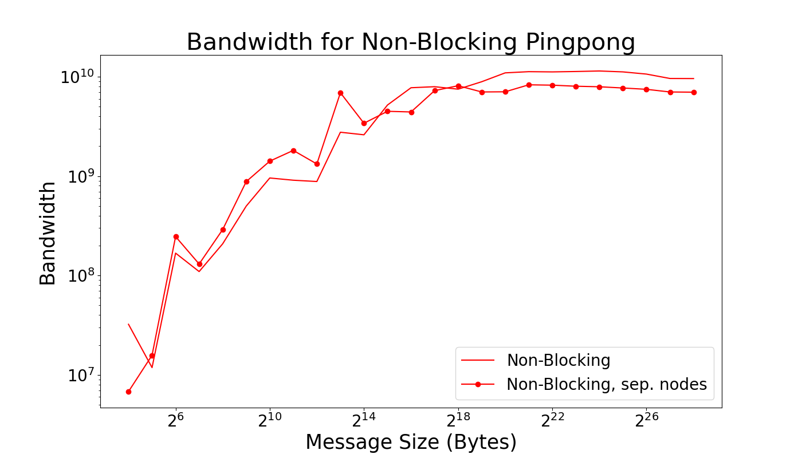
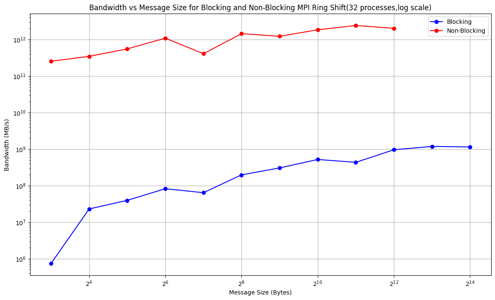

# Project 3

## Part 1

### 1.1 to 1.3 Solution 
 
Done! Check Part1.cpp. Executed on dev-amd20.

### 1.4 Solution 

Done! Check Part1.cpp. Different nodes ensured by binding each process to a different NUMA node.

### 1.5 Solution 

The latency for each is clearly different, but the effect seems to be lower at larger byte sizes where the latencies almost overlap. 

However, the bandwidth (which we strictly calculated and plot rather than estimating) seems to maintain a realtively constant difference (in a log/log plot).  

### 1.6 Solution 

For small messages sizes the average communication time is relatively flat as here we are bound by the latenecy of the system. This is not true for larger messages where we are bound by the bandwidth of the system. There are different latencies for different nodes which is why the horizontial(ish) lines at low message size are at different hieghts. The values converge at higher message sizes because the bandwidth should be (approximaetly) the same for the whole system as the whole system will have the same bandwidth. 

## Part 2

See Part2.cpp for code. Executed on dev-amd20, and different nodes ensured by binding each process to a different NUMA node.

The latency for each is clearly different, but at lower message sizes, ensuring separate nodes pays off. While at higher message sizes, the latency is higher for separate nodes.  

 

At low message sizes, the overhead associated with inter-node communication is relatively small. When both ping-pong processes are on separate nodes, the latency is reduced because communication between nodes typically involves higher overhead. As message size increases, the benefit of ensuring separate nodes reduces. At higher message size, the time spent on actual data transfer becomes a more dominant factor than the overhead of data transfer between physically separate nodes.

Opposed to latency, the bandwidth sees an opposite trend between same and separate nodes. Having both ping-pongs on separate nodes at low message sizes allows for more efficient use of the avaialable bandwidth. The reduced inter-node communication overhead allows a higher portion of the bandwidth to be utilized for actual data transfer. Whereas, the overhead becasue of longer physical distance between nodes becomes more pronounced at higher message size, leading to a reduction in effective bandwidth. 

### Comparison Blocking vs. Non-Blocking

The latency in non-blocking case is less than the latency of the blocking case. The lower latency in non-blocking communication is expected because processes can have an overlap in sending and receiving messages, reducing the overall time. The slightly chaotic behavior at small message sizes can be attributed to the overhead introduced by non-blocking communication. 

 

The consistently higher bandwidth in non-blocking communication compared to blocking aligns with our expectations, as it allows processes to operate more independently, enabling better utilization of available bandwidth / resources.

## Part 3 

As shown in the bandwidth vs message size figure above, the bandwidth decreases as the number of processes used are more. When the message size goes up, the bandwidth goes up as well for the blocking communication. The reason of this shape could be the increased complexity of managing more processes. In the blocking communication, each send and receive operation must be completed before processing, leading processes increases to wait for one another, especially in this ring shift pattern. When the number of processes increases, the total wait time accumulates because a message must pass through more nodes to complete the round. This increased waiting time can lead to lower overall bandwidth. 

Larger message sizes typically lead to better bandwidth utilization. The network's capacity is better utilized when sending larger chunks of data, leading to higher bandwidth measurements. 

As shown in the latency figure above, the latency is higher at bytes = 2 when more processes are used. Then, it dropped for message size of 4. It then take more latency when the message size get larger. When 128 processes were used, the latency did not show much increase accross the increase of the message size. The initial high latency at very small message sizes with more processes can be explained by the fixed overhead associated with each communication operation. This overhead is more obvious when the data transferred is minimal with more processes involved, and each processes add latency. 

The drop at 4 bytes could be how MPI is built to handle the samll messages. As message sizes increases, the latency naturally increases due to the longer time required to transmit larger amounts of data across network. Each process adds a delay due to communicatio and processing time. When more processes are used, efficient buffereing and pipeling can keep the increases minimal.  

## Part 4

The graph showing bandwidth versus message size tells us two things about non-blocking communication. First, as we use more processes, the bandwidth gets lower. This happens because, although non-blocking communication lets us do work while messages are being sent or received, handling many messages at once can become tricky. The more processes there are, the more effort it takes to keep track of all the messages, which can slow things down, especially if the network gets too busy.
Second, when we send bigger messages, the bandwidth increases. This is because with small messages, a lot of the time is taken up just getting the messages ready to send and dealing with them after they're received. But as messages get bigger, more of the time is spent actually sending data, which is more efficient and increases bandwidth.

When the number of processes used are not many, the latency genetly increases.  When we're not using many processes, latency - or the delay before a message is fully sent - slightly goes up. But when we use a lot of processes, the delay for the very small messages (like 2 bytes) starts off really high. Interestingly, for slightly bigger messages (4 and 8 bytes), this delay suddenly goes down a lot if we're using many processes. However, as we keep increasing the number of processes, the delay starts to climb again for these larger messages.

This pattern is mainly because when there are a lot of processes trying to send and receive messages at the same time, the network can get clogged up, which makes things slower. When you've got lots of messages flying around, the basic work needed just to handle a message (regardless of its size) adds up and becomes a big deal. Then, after the drop in delay for slightly bigger messages, if we continue to add more processes, the delay goes up again. This is likely because the network is struggling with the traffic, and it's also more complicated to manage all those messages at the same time.

